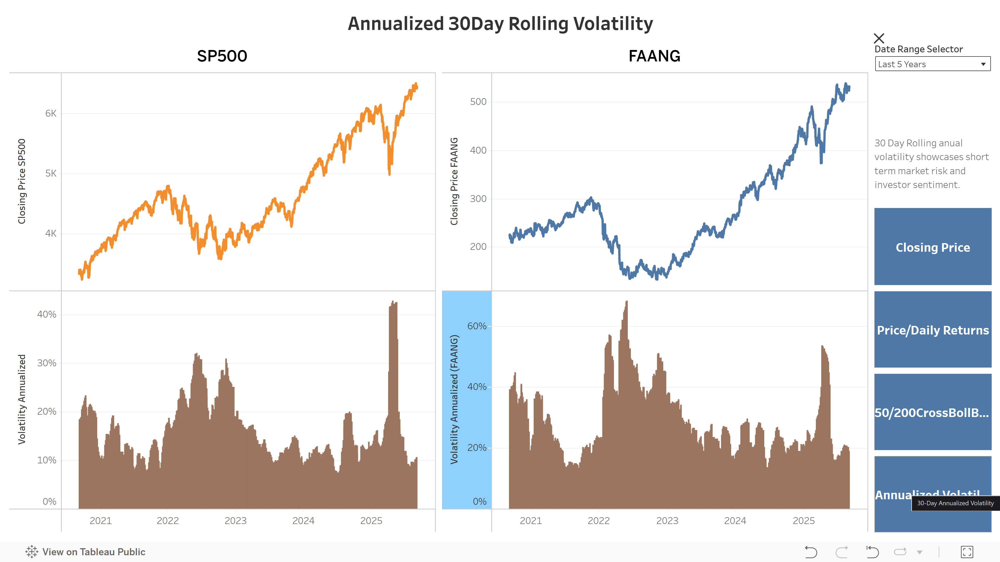

# 📈 S&P 500 vs FAANG Analysis & Dashboard

This project compares the performance and technical indicators of the **S&P 500 index** against the **FAANG group (Facebook, Amazon, Apple, Netflix, Google)**.  
It combines automated data collection, processing pipelines, and interactive visualizations in **Tableau Public**.

---

## 🔹 Motivation
FAANG companies have historically been major drivers of U.S. stock market performance.  
This project explores:
- How FAANG compares to the broader S&P 500 index
- Technical signals like **moving averages** and **volatility**
- Interactive dashboards for investors and analysts

---

## 🔹 Data Pipeline

The project is fully automated using **GitHub Actions**:

1. **Python Script** (`SP500_VS_FAANG.py`)  
   - Pulls daily stock price data  
   - Calculates technical indicators (MA50, MA200, Bollinger Bands, Volatility, Daily Returns)  
   - Exports results into CSVs  

2. **GitHub Actions Workflow**  
   - Runs the pipeline daily  
   - Updates processed CSVs in `/data/processed`  
   - Syncs data with Google Sheets for Tableau  

3. **Tableau Public Dashboard**  
   - Automatically refreshes when Google Sheets updates  

---

## 🔹 Tech Stack
- **Python**: Pandas, NumPy, yfinance  
- **Automation**: GitHub Actions  
- **Storage**: Google Sheets (connected to CSV pipeline)  
- **Visualization**: Tableau Public  

---

## 🔹 Interactive Dashboards

## Interactive Dashboard

👉 [View on Tableau Public]
[](https://public.tableau.com/views/SP500vsFAANG_17568134555740/ClosingPrice?:language=en-US&:sid=&:redirect=auth&:display_count=n&:origin=viz_share_link)


## Dashboard Previews

### Price Comparison


### Daily Returns Comparison


### Moving Averages & Bollinger Bands


### 30 Day Annualized Rolling Volatility


---

## 🔹 Key Insights
- **Golden Cross / Death Cross** events highlight long-term trend reversals.  
- **Bollinger Bands** capture price volatility spikes.  
- Although the correlation is visible, FAANG shows higher volatility compared to the broader S&P 500.  

---

## 🔹 Reproduce Locally

Clone the repo:
```bash
git clone https://github.com/hamdananas-alt/SP500_vs_FAANG_Project.git
cd SP500_vs_FAANG_Project
pip install -r requirements.txt
python scripts/SP500_VS_FAANG.py
