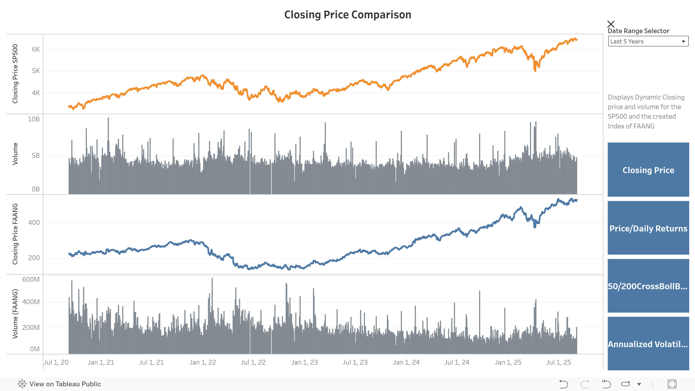
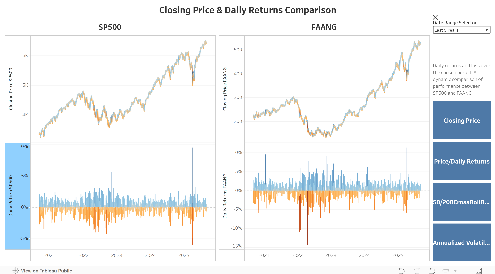
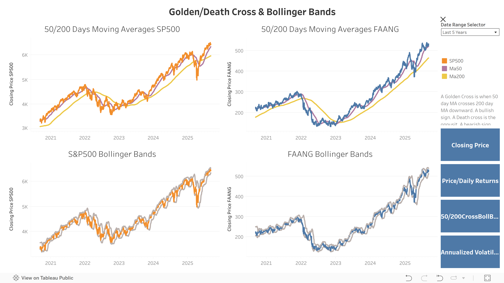
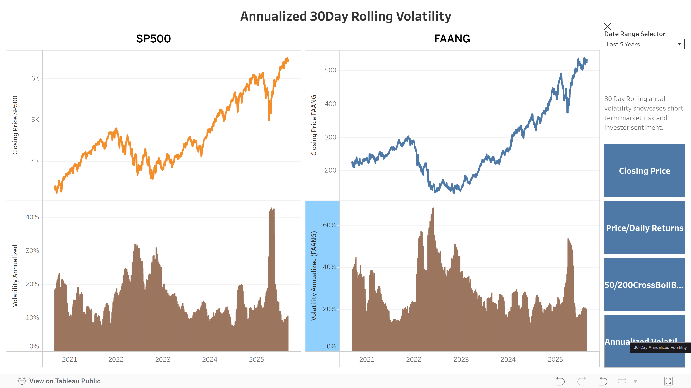

# S&P500 vs FAANG: Financial Health Analysis and Dashboard

## 🔹 Live Tableau Dashboard  
👉 [View the Interactive Dashboard](https://public.tableau.com/app/profile/anas.h2605/viz/SP500vsFAANG_17568134555740/ClosingPrice)  

---
## 🔹 Repository  
💻 Explore the full project code here:  
[GitHub Repo](https://github.com/hamdananas-alt/SP500_vs_FAANG_Project)  

---

## Business Objective
The goal of this project is to assess the financial health and trends of the S&P500 index and a newly created FAANG index, representing the five major technology companies (Facebook/META, Amazon, Apple, Netflix, Google). By analyzing their historical performance, volatility, and correlations, the project aims to determine whether investing exclusively in the FAANG stocks could serve as a viable alternative to investing in the broader S&P500.

## Data Collection & Cleaning
- **Data Source:** Yahoo Finance  
- **Time Horizon:** Last five years (automated daily updates)  
- **S&P500:** Raw market data including Open, High, Low, Close, and Volume was downloaded and cleaned. Missing values were forward- and backfilled, and zeros were treated as missing.  
- **FAANG Index Construction:** Each stock’s OHLCV data was averaged across the five companies to create a single representative index. Volume was summed to maintain market activity representation. We assumed this approach allows direct comparison between FAANG and the S&P500 on equal footing.  

## Metrics & Calculations
For both S&P500 and FAANG, the following metrics were computed:  
- **Price & Volume:** Daily closing prices and trading volumes.  
- **Moving Averages:** 50-day and 200-day simple moving averages to identify trend patterns.  
- **Bollinger Bands:** 20-day moving average ± 2 standard deviations to capture volatility envelopes.  
- **Daily Returns:** Percentage change day-over-day to understand short-term profitability.  
- **30-Day Rolling Volatility & Annualized Volatility:** Measures of price fluctuation and investor sentiment.  

All calculations are automated in Python and output as CSVs, which are dynamically updated and visualized in Tableau dashboards.
We had to use a work around through Google Sheets to enable Tableau public to have access to the daily updated csv files.

## Dashboards
1. **Price Comparison**  
   - Visualizes closing prices and volumes for S&P500 vs FAANG.  
   - Enables correlation observation between the indices over time.  

2. **Daily Returns**  
   - Tracks short-term P&L potential for both indices.  
   - Facilitates comparative assessment of risk vs reward.

3. **Moving Averages & Bollinger Bands**  
   - Provides trend analysis and market range visualizations.  
   - Highlights potential market signals through MA50/MA200 crossovers and Bollinger Band movements.  

4. **30-Day Rolling & Annualized Volatility**  
   - Compares market volatility between S&P500 and FAANG.  
   - Provides insight into investor sentiment and market stability.

## 🔹 Preview Screenshots  
### Dashboard 1: Price Comparison  
  

### Dashboard 2: Daily Returns  
  

### Dashboard 3: Moving Averages & Bollinger Bands  
  

### Dashboard 4: Annualized Volatility  
  

---

## Key Insights
- FAANG exhibits **higher volatility** compared to the S&P500.  
- Long-term performance trends of FAANG and the S&P500 are **very similar**, indicating that concentrated investment in FAANG stocks could be a viable alternative to broader market exposure.  
- The higher volatility of FAANG presents **potential for higher profit margins**, appealing to investors with a moderate-to-high risk tolerance.  

## 🔹 Live Tableau Dashboard  
👉 [View the Interactive Dashboard](https://public.tableau.com/app/profile/anas.h2605/viz/SP500vsFAANG_17568134555740/ClosingPrice)  

---
## 🔹 Repository  
💻 Explore the full project code here:  
[GitHub Repo](https://github.com/hamdananas-alt/SP500_vs_FAANG_Project)  

---

Thank you for your interest.
